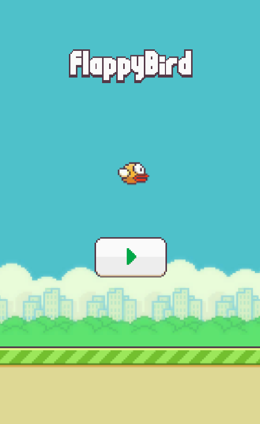

这是一个基于Unity 2021.3.12f1c1开发的2D像素游戏，参考几年前的游戏FlappyBird

- **Unity版本**：2021.3.14f1c1
- **编程语言**：C#

运行方法：
- **用Unity打开**：
   - 确保安装正确版本的Unity Hub
   - 选择项目文件夹中的根目录
 **运行场景**：
   - 打开 `Assets/Scenes/Main.unity`
   - 点击Play按钮

## 🖼️ 游戏截图

